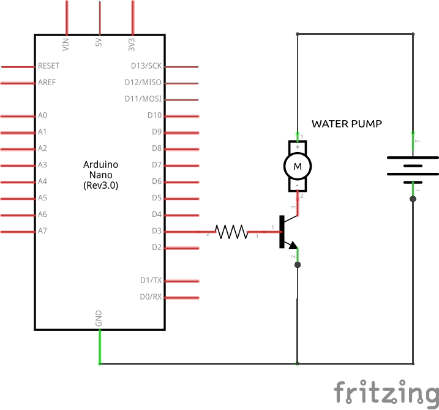
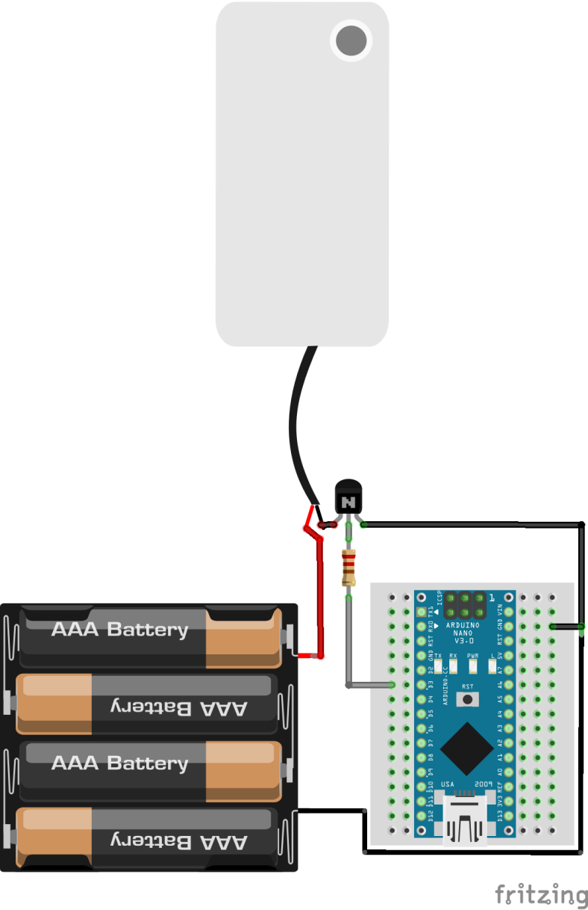

# DRIP

**Distributed Raspberry Irrigation Platform**

DRIP ist ein IoT-System zur Pflanzenüberwachung und automatischen Bewässerung. Das Projekt misst Bodenfeuchtigkeit, Lufttemperatur und Luftfeuchtigkeit, speichert die Werte in einem Backend, zeigt sie in einem Web-Dashboard an und kann bei zu trockener Erde automatisch eine Wasserpumpe aktivieren.

## Inhaltsverzeichnis

- [Projektidee](#projektidee)
- [Motivation und Einsatzgebiete](#motivation-und-einsatzgebiete)
- [Erfüllung der Anforderungen](#erfüllung-der-anforderungen)
- [Systemübersicht](#systemübersicht)
- [Hardware-Komponenten](#hardware-komponenten)
- [Schaltung und Schaltplan](#schaltung-und-schaltplan)
- [Software](#software)
- [Kommunikation](#kommunikation)
- [Externe Services](#externe-services)

## Projektidee

Viele Zimmerpflanzen werden entweder zu selten oder zu häufig gegossen. DRIP soll diese Pflege einfacher und nachvollziehbarer machen. Ein Mikrocontroller misst regelmäßig den Zustand der Pflanze und entscheidet anhand eines konfigurierbaren Grenzwerts, ob bewässert werden muss. Die gemessenen Werte werden an ein Backend geschickt und über ein Dashboard sichtbar gemacht.

Das Projekt besteht aus zwei Hardware-Boards:

- ein Sensor- und Aktuator-Board für Messung und Bewässerung
- ein Anzeige- und Feedback-Board für die Darstellung der aktuellen Messwerte

Zusätzlich gibt es ein Backend, eine Datenbank und ein Web-Frontend. Dadurch ist das Projekt nicht nur ein einzelner Sensoraufbau, sondern ein vollständiges IoT-System mit Gerät, Netzwerkkommunikation, Speicherung, Benutzeroberfläche und Benachrichtigung.

## Motivation und Einsatzgebiete

Die Motivation ist eine praktische Alltagssituation: Pflanzen sollen auch dann zuverlässig versorgt werden, wenn man nicht ständig selbst kontrollieren kann. Besonders nützlich ist das System für:

- Zimmerpflanzen in Wohnungen oder Büros
- Kräuterpflanzen wie Basilikum
- kurze Abwesenheiten, zum Beispiel Wochenenden oder Urlaube
- Lern- und Demonstrationszwecke für IoT, Sensorik, Aktuatorik und Webkommunikation

Der praktische Nutzen liegt darin, dass die Pflanze nicht nur überwacht wird, sondern das System auch selbst reagieren kann. Gleichzeitig bleiben Messwerte und Bewässerungen nachvollziehbar.

## Erfüllung der Anforderungen

| Nr. | Anforderung | Umsetzung in DRIP |
| --- | --- | --- |
| I | Verwendung von 2 Boards | Board 1 liest Sensoren aus und steuert die Pumpe. Board 2 ruft die neuesten Messwerte vom Backend ab und zeigt sie über LCD, LEDs und Buzzer an. |
| II | Mindestens 1 Sensor/Aktuator, der nicht Teil des IoT-Bundles ist | Der DHT22-Sensor für Temperatur/Luftfeuchtigkeit und die Wasserpumpe sind zusätzliche Komponenten außerhalb eines reinen Standard-Sensoraufbaus. |
| III | Insgesamt mindestens 3 Sensoren/Aktuatoren, davon mindestens 1 Sensor und 1 Aktuator | Verwendet werden Bodenfeuchtesensor, DHT22, Wasserpumpe, LCD, LEDs und Buzzer. Damit sind mehrere Sensoren und Aktuatoren vorhanden. |
| IV | Smartphone wird verwendet | Bewässerungsereignisse können per Discord-Webhook als Push-/Chat-Benachrichtigung am Smartphone ankommen. Das Dashboard ist aktuell nicht als Smartphone-Oberfläche umgesetzt. |
| V | Kabellose WiFi-Verbindung zu Computer oder Cloud | Beide Boards verwenden WiFi. Das Sensor-Board sendet Messwerte per HTTP an das Backend. Das Anzeige-Board ruft Messwerte per HTTP vom Backend ab. |

## Systemübersicht

```text
+-----------------------------+
| Sensor-/Pumpen-Board        |
| - Bodenfeuchtesensor        |
| - DHT22                     |
| - Wasserpumpe               |
+--------------+--------------+
               |
               | WiFi + HTTP/JSON
               v
+-----------------------------+
| Ktor Backend                |
| - REST API                  |
| - Pflanzen                  |
| - Messwerte                 |
| - Bewässerungsereignisse    |
+--------------+--------------+
               |
               | Datenbankzugriff
               v
+-----------------------------+
| PostgreSQL                  |
+-----------------------------+
               ^
               |
               | HTTP/JSON
+--------------+--------------+
| Vue Dashboard               |
| - Übersicht                 |
| - Messwerte                 |
| - Einstellungen             |
| - Benachrichtigungen        |
+-----------------------------+
               ^
               |
               | WiFi + HTTP/JSON
+--------------+--------------+
| Anzeige-/Feedback-Board     |
| - LCD                       |
| - LEDs                      |
| - Buzzer                    |
+-----------------------------+
```

## Hardware-Komponenten

### Board 1: Sensorik und Bewässerung

Dieses Board ist für die eigentliche Pflanzenüberwachung zuständig.

| Komponente | Aufgabe |
| --- | --- |
| RP2040-kompatibles Board mit WiFi | Führt die Firmware aus, liest Sensorwerte und kommuniziert mit dem Backend. |
| Bodenfeuchtesensor | Misst die Feuchtigkeit der Erde als analogen Wert. Dieser Wert wird in Prozent umgerechnet. |
| DHT22 | Misst Temperatur und Luftfeuchtigkeit in der Nähe der Pflanze. |
| Wasserpumpe | Bewässert die Pflanze, wenn die Bodenfeuchtigkeit unter den eingestellten Grenzwert fällt. |
| Status-LED | Zeigt an, dass die Firmware aktiv ist. |
| Schläuche/Wasserbehälter | Transportieren Wasser von der Quelle zur Pflanze. |

Der Bodenfeuchtesensor wird kalibriert, indem ein Rohwert für trockene und ein Rohwert für nasse Erde hinterlegt wird. Die Firmware rechnet den aktuellen Analogwert anschließend auf 0-100 Prozent um.

Der DHT22 ist wichtig, weil Pflanzenpflege nicht nur von Bodenfeuchte abhängt. Temperatur und Luftfeuchtigkeit liefern zusätzlichen Kontext und werden im Dashboard angezeigt. Der Sensor benötigt eine Spannungsversorgung, Masse und eine Datenleitung zum Mikrocontroller; in der Firmware ist der Datenpin als D16 definiert. Der Messwert wird über die DHT-Bibliothek ausgelesen, wodurch Temperatur und Luftfeuchtigkeit getrennt verarbeitet werden können.

Die Wasserpumpe ist der wichtigste Aktuator. Sie wird nicht dauerhaft betrieben, sondern nur für eine definierte Dauer aktiviert. Danach wartet das System eine kurze Settle-Zeit, damit das Wasser in der Erde ankommen kann, bevor erneut gemessen wird. Die Pumpe wird nicht direkt über den Mikrocontroller-Pin versorgt, weil sie mehr Strom benötigt als ein GPIO-Pin liefern kann. Stattdessen schaltet der Mikrocontroller über einen Widerstand einen Transistor, der den Pumpenstromkreis mit externer Batterieversorgung schließt. Der Widerstand begrenzt den Strom am Steuerpin und schützt dadurch den Mikrocontroller.

### Board 2: Anzeige und Feedback

Das zweite Board dient als lokales Ausgabegerät. Es verbindet sich ebenfalls per WiFi mit dem Netzwerk und fragt beim Backend den neuesten Messwert der Pflanze ab.

| Komponente | Aufgabe |
| --- | --- |
| RP2040-kompatibles Board mit WiFi | Ruft die neuesten Messwerte vom Backend ab. |
| LCD 16x2 | Zeigt Temperatur, Bodenfeuchtigkeit und Luftfeuchtigkeit an. |
| LEDs | Visualisieren den Temperaturzustand. |
| Buzzer | Gibt den Feuchtigkeitswert als Morsecode aus. |
| Taster | Startet das Abrufen und Anzeigen der aktuellen Messwerte. |

Das Anzeige-Board zeigt, dass die Daten nicht nur im Web-Dashboard verfügbar sind, sondern auch von einem zweiten physischen Gerät im Netzwerk verwendet werden können.

### Backend- und Anzeige-Hardware

Das Backend kann auf einem Computer, Raspberry Pi oder Homeserver laufen. Wichtig ist, dass es im selben Netzwerk erreichbar ist oder über eine konfigurierte Adresse angesprochen werden kann.

## Schaltung und Schaltplan

Die Schaltung wurde zunächst am Steckbrett aufgebaut. Noch fehlende Schaltplanbilder werden nachgereicht und hier eingefügt.

### Sensor-/Pumpen-Board

Schaltplan der Wasserpumpen-Ansteuerung:



Steckbrett-Aufbau der Wasserpumpen-Ansteuerung:



Wichtige Anschlüsse aus der Firmware:

| Signal | Anschluss |
| --- | --- |
| Bodenfeuchtesensor | A0 |
| DHT22 Datenpin | D16 |
| Wasserpumpe | D15 |
| Status-LED | eingebaute LED |

### Anzeige-/Feedback-Board

Platzhalter für Schaltplan:

```text
docs/images/schematic-display-board.png
```

Wichtige Anschlüsse aus der Firmware:

| Signal | Anschluss |
| --- | --- |
| LCD RS | D11 |
| LCD Enable | D12 |
| LCD D4-D7 | D2-D5 |
| Taster | D9 |
| Buzzer | D10 |
| LEDs | D6-D8 |

## Software

### Firmware Sensor-/Pumpen-Board

Die Firmware liegt im Ordner `picori-plant-monitor/`. Sie ist modular aufgebaut:

| Modul | Aufgabe |
| --- | --- |
| `application` | Initialisiert alle Komponenten und führt den Hauptzyklus aus. |
| `wifimanager` | Baut die WiFi-Verbindung auf. |
| `moisturesensor` | Liest den Bodenfeuchtesensor aus und rechnet Rohwerte in Prozent um. |
| `airsensor` | Liest Temperatur und Luftfeuchtigkeit über den DHT22. |
| `waterpump` | Schaltet die Pumpe für eine definierte Zeit ein. |
| `backendapi` | Sendet Messwerte und Bewässerungsereignisse an das Backend und lädt Bewässerungseinstellungen. |
| `statusled` | Schaltet die eingebaute LED als Aktivitätsanzeige. |

Ablauf im Messzyklus:

1. Sensorwerte werden gelesen.
2. Bodenfeuchte, Temperatur und Luftfeuchtigkeit werden seriell ausgegeben.
3. Wenn WiFi verbunden ist, wird der Messwert an das Backend gesendet.
4. Die aktuelle Bewässerungskonfiguration wird vom Backend geladen.
5. Wenn automatische Bewässerung aktiv ist und die Bodenfeuchte unter dem Grenzwert liegt, läuft die Pumpe.
6. Nach einer Bewässerung wird ein Bewässerungsereignis an das Backend gesendet.
7. Das System wartet bis zur nächsten Messung.

### Firmware Anzeige-/Feedback-Board

Die Firmware liegt im Ordner `arduino/morsecode_led_2ndBoard/`. Dieses Board verbindet sich per WiFi mit dem Backend. Wenn der Taster gedrückt wird, ruft es den neuesten Messwert ab.

Danach werden die Werte lokal ausgegeben:

- Temperatur und Feuchtigkeit erscheinen am LCD.
- LEDs zeigen abhängig von der Temperatur einen Zustand an.
- Der Buzzer gibt die Bodenfeuchtigkeit als Morsecode aus.

### Backend

Das Backend liegt im Ordner `ranelle-backend/` und ist mit Ktor in Kotlin umgesetzt. Es stellt eine REST API unter `/api/v1` bereit.

Wichtige Aufgaben:

- Pflanzen speichern und bearbeiten
- Messwerte speichern und abrufen
- neuesten Messwert einer Pflanze bereitstellen
- Bewässerungseinstellungen bereitstellen
- Bewässerungsereignisse speichern
- Pflegeinformationen für Pflanzen generieren

Die Daten werden in PostgreSQL gespeichert. Dadurch bleiben Messwerte und Einstellungen auch nach einem Neustart erhalten.

### Frontend

Das Frontend liegt im Ordner `faron-frontend/` und ist mit Vue umgesetzt.

Wichtige Funktionen:

- Übersicht über Pflanzen
- Detailansicht pro Pflanze
- Anzeige aktueller Werte und historischer Messwerte
- Einstellungen für automatische Bewässerung
- Grenzwert für Bodenfeuchtigkeit
- Pumpendauer
- Discord-Benachrichtigung bei neuen Bewässerungsereignissen

Der Smartphone-Teil des Projekts wird aktuell über Discord-Benachrichtigungen erfüllt. Das Dashboard ist als Weboberfläche für den normalen Browserbetrieb gedacht und wird nicht als mobile Smartphone-Oberfläche dokumentiert.

## Kommunikation

Die Kommunikation läuft über WiFi und HTTP mit JSON-Payloads.

### Sensor-/Pumpen-Board an Backend

Das Sensor-Board sendet Messwerte an:

```text
POST /api/v1/plants/{id}/measurements
```

Beispiel:

```json
{
  "temperature": 23,
  "soilMoisture": 41,
  "airMoisture": 55
}
```

Wenn die Pumpe gelaufen ist, sendet das Board ein Bewässerungsereignis an:

```text
POST /api/v1/plants/{id}/watering-events
```

Beispiel:

```json
{
  "moistureBefore": 31,
  "pumpDurationMs": 2000
}
```

### Backend an Sensor-/Pumpen-Board

Das Board lädt die aktuelle Bewässerungskonfiguration vom Backend:

```text
GET /api/v1/plants/{id}/watering-config
```

Beispiel:

```json
{
  "enabled": true,
  "moistureThreshold": 35,
  "pumpDurationMs": 2000,
  "waterSettleMs": 20000
}
```

Dadurch können Einstellungen im Dashboard geändert werden, ohne die Firmware neu zu flashen.

### Anzeige-/Feedback-Board an Backend

Das zweite Board ruft den neuesten Messwert ab:

```text
GET /api/v1/plants/{id}/measurements/latest
```

Der Rückgabewert enthält Temperatur, Bodenfeuchtigkeit, Luftfeuchtigkeit und Zeitstempel.

### Frontend an Backend

Das Frontend kommuniziert ebenfalls über HTTP mit dem Backend. Es liest Pflanzen, Messwerte und Bewässerungsereignisse und speichert geänderte Einstellungen.

## Externe Services

### Discord Webhook

Für Smartphone-Benachrichtigungen kann ein Discord-Webhook verwendet werden. Das Frontend prüft neue Bewässerungsereignisse und sendet bei aktivierter Einstellung eine Nachricht an Discord. Auf dem Smartphone erscheint diese Nachricht als normale Discord-Push-Benachrichtigung.

Damit wird keine eigene Push-Infrastruktur benötigt. Discord übernimmt die Zustellung an Smartphone und Desktop.

### OpenAI Pflegeinformationen

Das Backend enthält einen Service, der Pflegeinformationen für Pflanzen generieren kann. Diese Informationen unterstützen beim Anlegen neuer Pflanzen, zum Beispiel mit empfohlenen Bereichen für Temperatur, Bodenfeuchtigkeit und Luftfeuchtigkeit.

Dieser Teil ist eine Zusatzfunktion und nicht notwendig für die Grundfunktion der Bewässerung.
